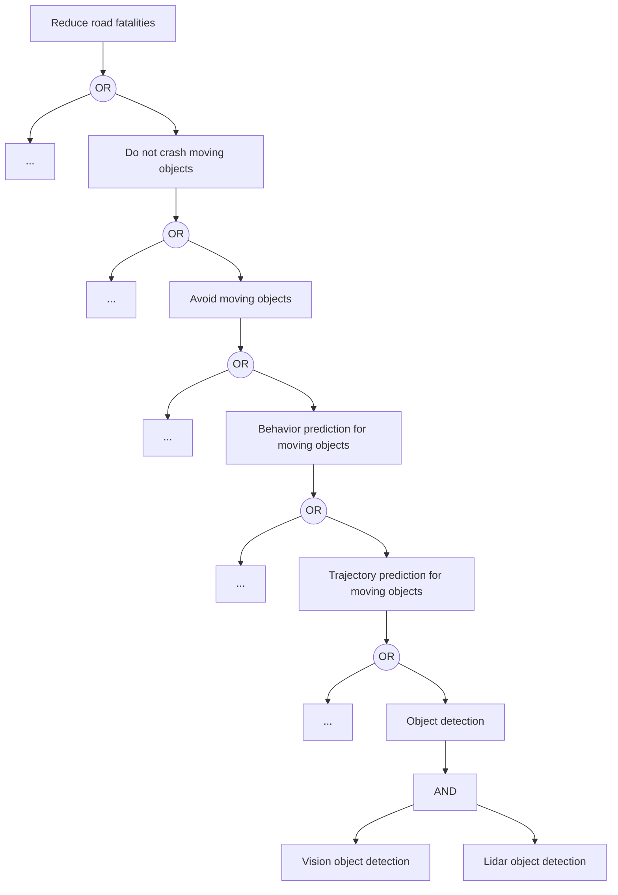

# High-Level System Design

Based on [https://github.com/eugeneyan/ml-design-docs](https://github.com/eugeneyan/ml-design-docs).

## Project Description

Define the problem statement and objectives.

## High-Level Design

Diagram of the overall system architecture (data flows, components, and interactions).
Description of the ML models involved, including short description.

## Data Requirements

Specify the datasets and data updates.
Describe (high level) the data preprocessing steps and how data will be managed and stored.

## Service Decomposition

Break down the system into microservices.
Describe the role and functionality of each service in the context of the overall system.
Explain the communication between services (e.g., REST APIs, message queues).

## Requirements Specification

List the operational requirements for each service, like: scalability, performance.
Specify the tools and technologies that you'll use for the implementation.

## Evaluation Metrics

Define how the performance of the machine learning model will be measured.
Outline the criteria for success of the overall system from both a technical and business perspective.

# ml-design-doc

## 1. Overview

> A summary of the doc's purpose, problem, solution, and desired outcome, usually in 3-5 sentences.

Autonomous driving car that can drive by itself.

## 2. Motivation

> Why the problem is important to solve, and why now.

- Decrease number of road fatalities.
- As a side goal - free people from driving.

## 3. Success metrics

> Usually framed as business goals, such as increased customer engagement (e.g., CTR, DAU), revenue, or reduced cost.

Statistics for road fatalities in Europe is 10000 per year (reference to graph and data). First goal is to reduce road fatalities by factor of 2, 5000 per year.

## 4. Requirements & Constraints

> Functional requirements are those that should be met to ship the project. They should be described in terms of the customer perspective and benefit. (See [this](https://eugeneyan.com/writing/ml-design-docs/#the-why-and-what-of-design-docs) for more details.)
>
> Non-functional/technical requirements are those that define system quality and how the system should be implemented. These include performance (throughput, latency, error rates), cost (infra cost, ops effort), security, data privacy, etc.
>
> Constraints can come in the form of non-functional requirements (e.g., cost below $`x` a month, p99 latency < `y`ms)

Functional requirements:

- Drive by itself in a defined road

Non-functional requirements:

- Realtime inference time
- Is able to run with X VRAM
- Code Quality
- Functional safety

Constraints:

- ???

### 4.1 What's in-scope & out-of-scope?

> Some problems are too big to solve all at once. Be clear about what's out of scope.

In scope:

- Vision object detection module for moving objects

Out of scope:

- Vision object detection for static objects
- Exact metric definition. It requires full automotive system deging with safety goals, functional safety considerations and udage of road fatalities statistics.
- Model speedup (inference time optimizations)
- VRAM constraints
- Interface with other modules
- Other modules needed for autonomous driving architecture
- Data privacy
- Data security

## 5. Methodology

### 5.1. Problem statement

> How will you frame the problem? For example, fraud detection can be framed as an unsupervised (outlier detection, graph cluster) or supervised problem (e.g., classification).

Object detection, supervised. For every frame output list of object bounding boxes with assigned label.

### 5.2. Data

> What data will you use to train your model? What input data is needed during serving?

ZOD dataset (link, reference)
Training: train dataset with frames with ground truth bounding boxes + corresponding lidar frames (for determining the distance to the car)
Testing: val dataset with frames.

### 5.3. Techniques

> What machine learning techniques will you use? How will you clean and prepare the data (e.g., excluding outliers) and create features?

Yolo or other state of the arch object detector. Train with data.

### 5.4. Experimentation & Validation

> How will you validate your approach offline? What offline evaluation metrics will you use?
>
> If you're A/B testing, how will you assign treatment and control (e.g., customer vs. session-based) and what metrics will you measure? What are the success and [guardrail](https://medium.com/airbnb-engineering/designing-experimentation-guardrails-ed6a976ec669) metrics?

TODO: Describe metrics here.

## 6. Implementation

### 6.1. High-level design

> Start by providing a big-picture view.

Visual object detection is a module that predicts moving objects on every video frame. One of the users in overall system is `Trajectory prediction for moving objects` module. Find below the possible business goal decomposition. Blocks with `...` mean that there might be other equivalent blocks on the same tree level. Last level is `AND` decomposition used to make the system safer by calculation the same task from two different signal sources.

### 6.2. Infra

> How will you host your system? On-premise, cloud, or hybrid? This will define the rest of this section

System is run on emdedded device with GPU (like NVidia drive PX) in the car. 

### 6.3. Performance (Throughput, Latency)

> How will your system meet the throughput and latency requirements? Will it scale vertically or horizontally?

Realtime, X ms for frame, Y MB VRAM peak consumption. The model shall be optimized for inference time by industry-standard inference-time optimization techniques (pruning, transfer learning, quantization). Out of scope for this design document.

### 6.8. Integration points

> How will your system integrate with upstream data and downstream users?

Module integration is out of the scope of the document.

### 6.9. Risks & Uncertainties

> Risks are the known unknowns; uncertainties are the unknown unknows. What worries you and you would like others to review?

Risks:

- Missing dynamic object may result in crash.
- Misdetection of existing objects may result in dangerous maneuvers (that are better to avoid).

Uncertainties:

- Critical weather and earth conditions (for example, hurricane, tsunami, earthquake).

## 7. Appendix

### 7.1. Alternatives

> What alternatives did you consider and exclude? List pros and cons of each alternative and the rationale for your decision.

### 7.2. Experiment Results

> Share any results of offline experiments that you conducted.

### 7.3. Performance benchmarks

> Share any performance benchmarks you ran (e.g., throughput vs. latency vs. instance size/count).

### 7.4. Milestones & Timeline

> What are the key milestones for this system and the estimated timeline?

### 7.5. Glossary

> Define and link to business or technical terms.

### 7.6. References

> Add references that you might have consulted for your methodology.

TBD
