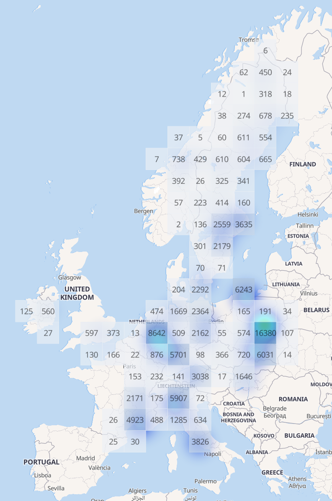
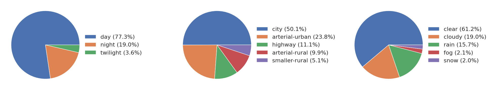
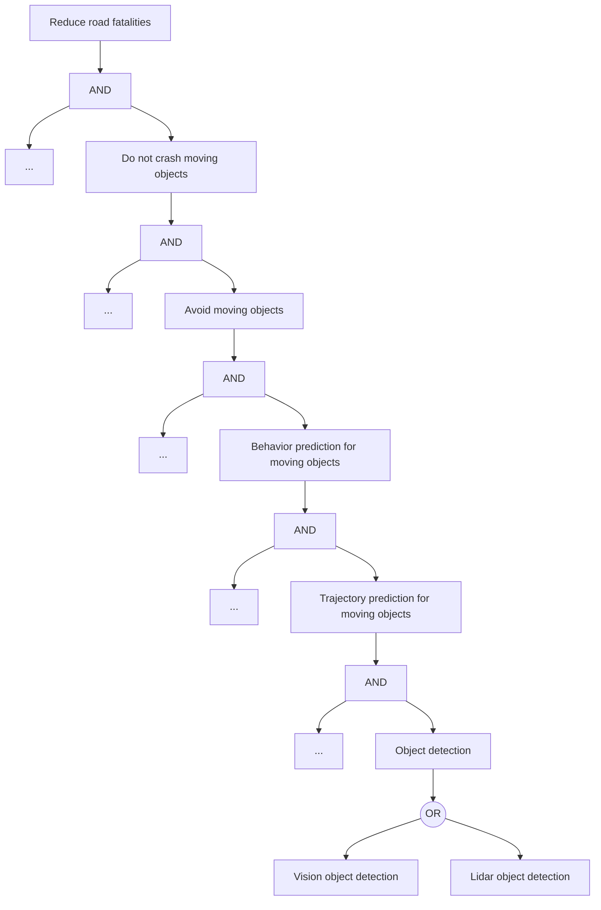
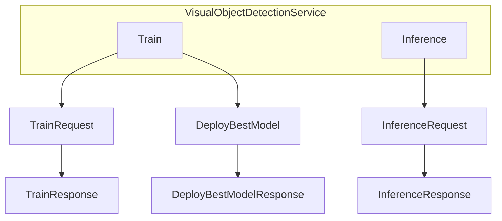
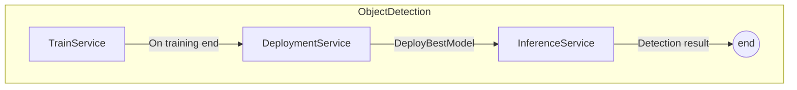
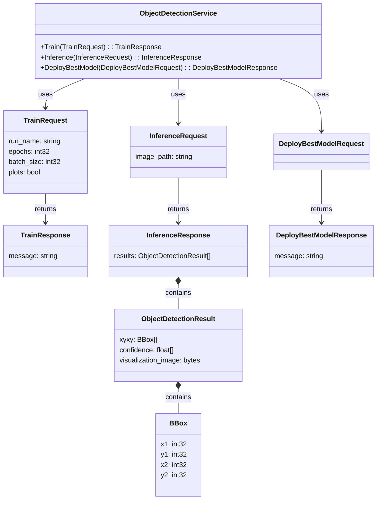

# Visual Object Detection for Autonomous Driving - High-Level System Design

System design doc is based on [https://github.com/eugeneyan/ml-design-docs](https://github.com/eugeneyan/ml-design-docs).

## 1. Overview

[//]: # (> A summary of the doc's purpose, problem, solution, and desired outcome, usually in 3-5 sentences.)

The goal of this document is to design one of the modules for safe autonomous driving car. Vision dynamic object detection can be used by various car's subsystems and it's therefore it is important that it would have a good accuracy. Also, it shall have low memory footprint and work real time because there might be other modules and resources on embedded devices are sparse.

## 2. Motivation

[//]: # (> Why the problem is important to solve, and why now.)

- Decrease number of road fatalities.
- As a side goal - free people from driving.

## 3. Success metrics

[//]: # (> Usually framed as business goals, such as increased customer engagement e.g., CTR, DAU, revenue, or reduced cost.)

Statistics for road fatalities in Europe is 10000 per year (TODO: add reference, and graph and data). First goal is to reduce road fatalities by factor of 2, 5000 per year. For visual object detection module, this number would transfer to problem-domain number(s) with system decomposition (not in the scope of this project).

For object detection in context of autonomous driving, it is very important not to miss objects. False positives shall be also controlled because big amount can lead to system instability. Thought in case of false positives, there are possible mitigation strategies.

Object detection metrics:

- False Negative Rate (FNR) for every class. Since missing pedestrians and vulnerable vehicles is highly critical, the FNR for these classes should be minimized.
- True Positive Rate (TPR) for every class. Also known as Recall or Sensitivity, it is particularly important for classes where missing an object could be dangerous.
- False Positive Rate (FPR) for every class. While False Positives are less critical than False Negatives, they still need to be managed. High FPR can lead to other subsystems not working correctly. FPR measures the proportion of non-objects that are incorrectly identified as objects.
- Precision, Recall, F1-score.
- Mean average precision (mAP).
  - or class-specific weighted mAP.

## 4. Requirements & Constraints

[//]: # (> Functional requirements are those that should be met to ship the project. They should be described in terms of the customer perspective and benefit)
[//]: # (> Non-functional/technical requirements are those that define system quality and how the system should be implemented. These include performance - throughput, latency, error rates, cost - infra cost, ops effort, security, data privacy, etc.)
[//]: # (> Constraints can come in the form of non-functional requirements e.g., cost below $`x` a month, p99 latency < `y`ms)

Functional requirements:

- Overall: Cat can drive without driver safely in a defined road.
- Object detection module: detect objects on video stream for every frame with metrics not less than XXX (the actual number usually derived from safety and risk analysis).

Non-functional requirements:

- Realtime inference time.
- Code Quality.
- Functional safety.
- Other industry certifications.

Constraints:

- VRAM consumption is not more than X MB.

### 4.1 What's in-scope & out-of-scope?

[//]: # (> Some problems are too big to solve all at once. Be clear about what's out of scope.)

In scope:

- Vision object detection module for moving objects.
- Classes: vehicles, pedestrians, vulnerable vehicles (bicycles, scooters, ...).

Out of scope:

- Deployment on the embedded device. Thought it would be very good for this course, as for now I do not have any embedded device with me.
- Getting very good detection score. The purpose of this project is to learn building data pipelines.
- Vision object detection for static objects.
- Exact metric threshold requirements. It requires full automotive system design with safety goals, functional safety considerations and usage of road fatalities statistics.
- Model speedup (inference time optimizations).
- VRAM constraints.
- Interface with other modules.
- Other modules needed for autonomous driving architecture.
- Data privacy.
- Data security.

## 5. Methodology

### 5.1. Problem statement

[//]: # (> How will you frame the problem? For example, fraud detection can be framed as an unsupervised - outlier detection, graph cluster - or supervised problem e.g., classification.)

Object detection and classification of detected objects, supervised. For every video frame (or image) output list of object bounding boxes with assigned label.

### 5.2. Data

[//]: # (> What data will you use to train your model? What input data is needed during serving?)

Dataset - [ZOD](https://zod.zenseact.com/), subset Frames. The dataset has driving data from various countries, lighting conditions, road surface conditions, type (rural/city).

<figure>
  
  <figcaption>Geographical distribution of ZOD Frames</figcaption>
</figure>

<figure>
  
  <figcaption>Distribution over time of day (left), road type (center), and weather (right) in ZOD Frames</figcaption>
</figure>

<!-- 
 -->

Data will be updated (added) by country. The model will be updated (retrained from the scratch or from the same pre-trained model) when new data arrives. If some country has a really big amount of data, data from one country can be added in chunks.
Original dataset format is in ZOD internal format (images in png, annotations in json, Lidar in numpy files). They are stored on disk as files. Dataset size with one lidar scan (for key frame only) is approximately 800 GB.

Available types of annotations are described [by link](https://zod.zenseact.com/annotations/). Only `unclear=False`, `occlusion_ratio=None or Light or Medium` are used for training and evaluation. Additionally, Lidar data can be used for object distance evaluation (TBD).

Model considers only dynamic objects of types `Vehicle`, `VulnerableVehicle` and `Pedestrian`.

### 5.3. Techniques

[//]: # (> What machine learning techniques will you use? How will you clean and prepare the data e.g., excluding outliers and create features?)

Yolo or other state of the art object detector, with a small memory footprint. The objects for staining and validation will be filtered by `unclear=False`, `occlusion_ratio=None or Light or Medium`.

### 5.4. Experimentation & Validation

[//]: # (> How will you validate your approach offline? What offline evaluation metrics will you use?)
[//]: # (>)
[//]: # (> If you're A/B testing, how will you assign treatment and control e.g., customer vs. session-based and what metrics will you measure? What are the success and guardrail metrics?)

Performance will be measures by metrics described in [success metrics chapter](## 3. Success metrics).

(In case of deployment on embedded device) Runtime measurement and memory consumption measurement.

## 6. Implementation

### 6.1. High-level design

[//]: # (> Start by providing a big-picture view.)

Visual object detection is a module that predicts moving objects on every video frame. One of the users can be `Trajectory prediction for moving objects` module. Below you will find the possible business goal decomposition. Blocks with `...` mean that there might be other equivalent blocks on the same tree level who contribute to upper-level task. Last level is `OR` decomposition used to make the system safer by calculation the same task from two different signal sources and then combining the computation results.

Proposed service architecture for the first iteration. The diagram illustrates the interaction between the ObjectDetectionService and other components.

TODO: Separate services for Train and Inference.

Train and inference are completely different beasts. While train instance require huge amounts of GPU resources, inference is lightweight. Example:

### 6.2. Infra

[//]: # (> How will you host your system? On-premise, cloud, or hybrid? This will define the rest of this section)

Module is run on embedded device with GPU (like NVidia drive PX) in the car.

### 6.3. Performance (Throughput, Latency)

[//]: # (> How will your system meet the throughput and latency requirements? Will it scale vertically or horizontally?)

Realtime, X ms for frame, Y MB VRAM peak consumption. The model shall be optimized for inference time by industry-standard inference-time optimization techniques (pruning, transfer learning, quantization). Out of scope for this project.

### 6.8. Integration points

[//]: # (> How will your system integrate with upstream data and downstream users?)

Module integration is out of the scope of the document.

### 6.9. Risks & Uncertainties

[//]: # (> Risks are the known unknowns; uncertainties are the unknown unknows. What worries you and you would like others to review?)

Risks:

- Missing dynamic object may result in crash.
- Misdetection of existing objects may result in dangerous maneuvers (that are better to avoid).

Uncertainties:

- Critical weather and earth conditions (for example, hurricane, tsunami, earthquake).

## 7. Appendix

### 7.1 gRPC service structure

A diagram for the gRPC services that helps visualize the different requests and responses:

### 7.1. Alternatives

[//]: # (> What alternatives did you consider and exclude? List pros and cons of each alternative and the rationale for your decision.)

TBD

### 7.2. Experiment Results

[//]: # (> Share any results of offline experiments that you conducted.)

TBD

### 7.3. Performance benchmarks

[//]: # (> Share any performance benchmarks you ran e.g., throughput vs. latency vs. instance size/count.)

TBD

### 7.4. Milestones & Timeline

[//]: # (> What are the key milestones for this system and the estimated timeline?)

- Vision object detection trained on small portion of data
- Data pipelines for adding data and running training for every new country
- ...

### 7.5. Glossary

[//]: # (> Define and link to business or technical terms.)

TBD

### 7.6. References

[//]: # (> Add references that you might have consulted for your methodology.)

TBD
